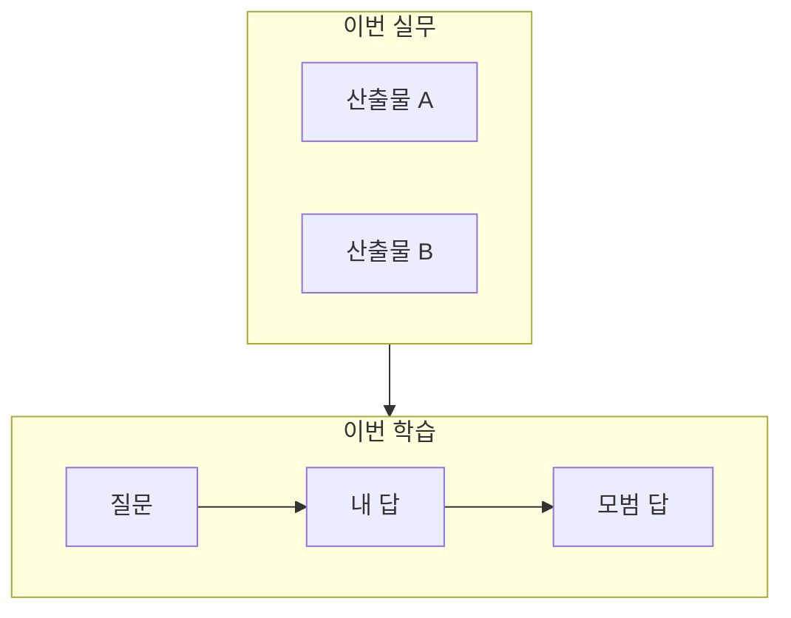
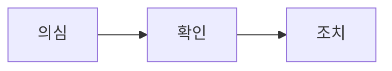

<!--
작성 가이드. 이 블록은 페이지에 나오지 않는다. 발행 전에 지워도 된다.

목적: 복습과 공유를 한 글에 둔다.
톤: 비전공자도 읽히는 한국어. 용어는 처음 나올 때 한 줄로 정의한다. 일상 비유는 하나.
Mermaid: flowchart 만 쓴다. pie, gantt, mindmap, timeline 은 쓰지 않는다.
넣지 않음: Cursor 단축키, 대시보드식 잡다한 절.

채팅에서 가져온 초안은 아래 4단에만 넣는다. 빈 칸만 채운다.
트러블이 없으면 2절 제목을 「헷갈리기 쉬운 지점」으로 바꾸고 표만 채운다.
면접이 없으면 3-2 제목을 「셀프 점검 Q&A」로 바꾸고 점수 줄은 지운다.
섹션 번호와 이름(1 도입, 2 트러블슈팅, 3 해결 과정, 4 딥다이브)은 유지한다.
한 줄 요약 인용에는 {: .wn-lede } 를 붙인다. 이 클래스만 강조 인용으로 보인다.

파일 이름: _posts/YYYY-MM-DD-짧은-영문-슬러그.md
-->

## 1. 도입 (Context & Goal)

한 줄로 말하면 이렇습니다.

> 무엇을 했고, 무엇을 배웠는지 한 문장
{: .wn-lede}

### 당시 목표

- 독자가 이 글을 읽고 할 수 있는 것
- 
- 

비유: 일상에서 가져올 장면 하나. 비유는 이 문단에서 끝내고, 아래 절에서 다시 풀지 않는다.



## 2. 트러블슈팅 (Micro-Debugging)

막힌 지점은 명령어를 몰라서가 아니라, 개념이 섞인 지점이었습니다.

| 증상처럼 보이는 것 | 실제 원인에 가까운 것 |
| --- | --- |
| 화면에 보인 현상 | 그래서 생긴 개념 |
|  |  |



## 3. 해결 과정 & 코드 (Solution)

### 3-1. 실무로 한 일 (Before / After)

**Before**

```text
이전 상태. 원격 주소, 설정, 폴더 구조처럼 바뀌기 전 모습.
```

**After**

```text
이후 상태. 무엇이 달라졌는지 결과만.
```

순서:

1. 첫 번째로 한 일
2. 
3. 

```bash
# 핵심 명령이 있을 때만 남긴다
```

```ts
// 핵심 코드가 있을 때만 남긴다
```

### 3-2. 면접 연습 종합: 질문 → 내 답 → 점수 → 모범 답

아래가 이번 학습의 핵심입니다. 면접이 없으면 제목을 「셀프 점검 Q&A」로 바꾸고, 점수 문장은 지웁니다.

<div class="wn-round" markdown="1">

#### 라운드 A — 주제

**질문.** 한 문장으로 묻는다.

**내 답.** 그때 실제로 말한 답.

**점수.** 대략 몇 점인지, 무엇이 빠졌는지 한 줄.

**모범 답.** 다음에 이렇게 말한다.

</div>

<div class="wn-round" markdown="1">

#### 라운드 B — 주제

**질문.**

**내 답.**

**점수.**

**모범 답.**

</div>

### 3-3. 점수 한눈에

| 라운드 | 주제 | 점수 | 한 줄 피드백 |
| --- | --- | --- | --- |
| A |  |  |  |
| B |  |  |  |

성장 곡선: 처음에는 무엇을 몰랐고, 끝에는 무엇을 말하게 됐는지. 남은 과제 하나.

## 4. 딥다이브 (What I Learned)

### Framework Deep-Dive

이 도구가 하는 일을 역할 비유 하나로 적는다. 동작 원리는 세 문장 안에 끝낸다.

### Performance & Memory (리스크)

느려지거나, 메모리가 늘거나, 되돌리기 어려운 지점. 해당 없으면 「이번 범위에서는 비용이 크지 않다」고 한 줄만 남긴다.

### Industry Convention

같은 변경을 PR로 올리면 리뷰에서 먼저 보는 것.

### 주니어 실전 팁 3가지

1. 
2. 
3. 
