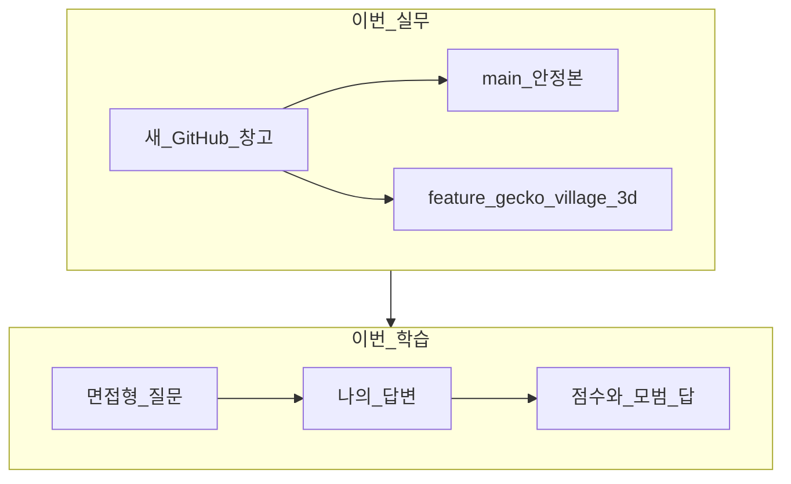
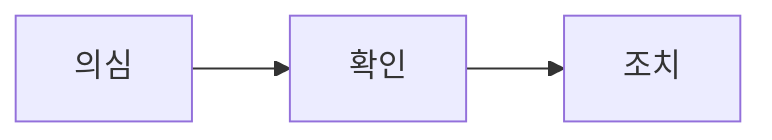
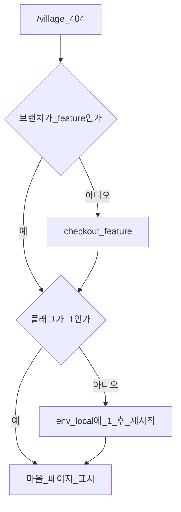

## 1. 도입 (Context & Goal)

한 줄로 말하면 이렇습니다.

> 새 GitHub “창고”에 **안정본(`main`)** 과 **3D 마을 실험본(브랜치)** 을 나눠 올려 두었고, 그 과정에서 Git 용어·PR·revert·404 원인을 **질문 → 내 답 → 점수·모범 답**으로 반복 학습했다.
{: .wn-lede }

### 당시 목표
- 옛 원격(`Reptilia_MS`) → 새 저장소 `Reptilia_Management_System` 로 이전
- 기존 이용자 페이지는 유지, `/village` 3D 마을만 **격리 실험**
- GitHub가 낯설어, “올렸으면 끝”이 아니라 **의심 → 확인 → 조치** 습관을 몸에 붙이기

비유: 운영 상점 문은 그대로 두고 옆 공터에 모형 마을을 세운 뒤, 서류함에는 **정식 장부**와 **실험 공책**을 따로 보관하기.



---

## 2. 트러블슈팅 (Micro-Debugging)

막힌 지점은 “명령어를 몰라서”보다 **개념이 섞인 지점**이었습니다.

| 증상처럼 보이는 것 | 실제 원인에 가까운 것 |
|-------------------|----------------------|
| 새 리포가 비어 있음 | 비교 기준인 `main`이 없으면 PR이 흔들림 |
| 브랜치 이름에 village | 안에 **다른 커밋·파일**이 섞일 수 있음 |
| `/village` 404 | 버그보다 **브랜치/플래그** 먼저 |
| `git add .` 후 커밋 | push 전이면 **커밋 취소 후 재선택**이 안전 |
| Merge 후 revert | 원격만 바뀌고, pull 안 한 PC는 **옛 상태** |



---

## 3. 해결 과정 & 코드 (Solution)

### 3-1. 실무로 한 일 (Before / After)

**Before — 옛 창고**

```text
origin  https://github.com/Weo0o0/Reptilia_MS.git
```

**After — 새 창고 + 줄기 분리**

```text
origin  https://github.com/Weo0o0/Reptilia_Management_System.git
```

순서:
1. `main` push → 빈 리포에 **뼈대** 생성  
2. 마을 파일만 커밋 (`feat(village): add isolated /village 3D lab behind feature flag`)  
3. `feature/gecko-village-3d` push  

마을 문 열쇠:

```bash
NEXT_PUBLIC_ENABLE_VILLAGE_3D=1
```

```ts
export function isVillage3dEnabled(): boolean {
  return process.env.NEXT_PUBLIC_ENABLE_VILLAGE_3D === "1";
}
```

---

### 3-2. 면접 연습 종합: 질문 → 내 답 → 점수 → 모범 답

아래가 이번 대화의 **핵심 산출물**입니다.

#### 라운드 A — 왜 `main`을 먼저? / 마을만 합치려면?

**질문 A1.** 새 리포가 비었을 때 왜 `main`을 먼저 push하는가?  
**내 답.** `main`을 먼저 올려 뼈대를 만들어 안전하다.  
**점수.** 약 70 — 방향 맞음, “비교 기준/기본 줄기”까지 말하면 더 좋음.  
**모범 답.** 빈 저장소에서는 `main`을 공식 기준선으로 두어, 이후 PR에서 실험 브랜치와 **차이를 비교**할 수 있게 한다.

**질문 A2.** 브랜치에 마을+다른 커밋이 섞이면 PR에서 무엇을 보고, 마을만 합치려면?  
**내 답.** PR에서 다른 브랜치 작업을 볼 수 있다. 마을만 합치려면 다른 브랜치에서 마을을 PR해 `main`에 푸시한다.  
**점수.** 약 45 — PR≠push 혼동, “다른 브랜치에서 PR”이 마을-only 전략이 아님.  
**모범 답.** PR은 `main` 대비 **이 브랜치 전체 차이**를 본다. 섞였으면 Files changed 확인 후, `main`에서 **마을만 담은 새 브랜치**로 다시 PR한다.

---

#### 라운드 B — Files changed에 파일 수백 개 / 이미 통째 Merge

**질문 B1.** 마을 말고 관리자·홈이 수백 개면?  
**내 답.** 수백 개가 정말 `/village` 관련인지 의심한다.  
**점수.** 약 65 — 의심은 합격, `git log`/`git diff`·Merge 보류까지 말해야 함.  
**모범 답.** 다른 기능 커밋 섞임을 의심 → log/diff로 확인 → Merge하지 말고 마을-only 브랜치로 재PR.

**질문 B2.** 이미 통째 Merge 후 마을만 남기고 싶으면?  
**내 답.** 서비스가 안 돌고 파일 연결이 끊겨 프로젝트가 망할 확률이 매우 높다.  
**점수.** 약 40 — 너무 단정·막연. “항상 사망”이 아니라 **원치 않은 변경이 정식본에 남음**.  
**모범 답.** 로그로 합쳐진 범위 확인 → 가능하면 Merge revert → 마을만 다시 PR. 감으로 파일 대량 삭제부터 하지 않는다.

---

#### 라운드 C — revert 후 다른 컴퓨터

**질문 C.** `git revert`로 Merge를 되돌리면, 이미 그 `main`을 pull한 사람 PC에는? 팀에 뭐라고?  
**내 답.** 여러 경로 파일이 우후죽순이라 영향 줄 수 있다. Merge 전 미리 되돌릴 테니 며칠·몇 시간 전까지 준비하라고 한다.  
**점수.** 약 60 — 공지·시간 여유는 좋음, 질문은 **revert 이후**인데 답이 **Merge 전 공지**에 가까움.  
**모범 답.** revert는 GitHub `main`만 최신으로 바꾸고, pull 안 한 로컬은 옛 상태. **즉시 pull**, 진행 중 작업 충돌 가능성 공유, 앞으로는 그 Merge 기준 새 작업 금지.

공지 예시:

```text
main에서 해당 Merge를 revert 했습니다.
지금 main을 pull 받아 주세요.
실험 브랜치 위 작업이 있으면 알려 주세요.
마을만 다시 깔끔한 PR로 올릴 예정입니다.
```

---

#### 라운드 D — 잘못된 커밋(push 전) / `/village` 404

**질문 D1.** `git add .`로 홈·관리자까지 커밋, **아직 push 전**이면?  
**내 답.**  
1. 의심: add .로 마을과 무관한 파일이 섞였는지  
2. 확인: 커밋 파일이 기능에 쓰이는지  
3. 조치: 불필요하면 제거·수정  
**점수.** 약 70 — 의심 좋음, push 전 정석은 **soft reset 후 재선택**.  
**모범 답.**

```bash
git reset --soft HEAD~1   # 커밋만 취소, 파일은 유지
# 마을 경로만 다시 git add
git commit -m "feat(village): ..."
```

**질문 D2.** 동료는 `main`에서 정상, 나는 `/village` 404, 코드는 feature 브랜치에 있으면?  
**내 답.** 환경을 맞추고, village에서 작업하는데 feature 환경에서 사이트가 되면 문제다.  
**점수.** 약 45 — 환경 통일은 틀린 방향은 아니나, 이번 키는 **브랜치 + 플래그**. 동료 `main` 정상은 자연스러울 수 있음.  
**모범 답.** (1) `git branch`로 마을 브랜치인지 (2) `.env.local`에 `NEXT_PUBLIC_ENABLE_VILLAGE_3D=1`인지 확인 후 dev 재시작.



---

### 3-3. 점수 한눈에

| 라운드 | 주제 | 점수(대략) | 한 줄 피드백 |
|--------|------|------------|--------------|
| A1 | main 먼저 | 70 | 뼈대=기준선까지 말하면 완성 |
| A2 | 마을만 PR | 45 | PR≠push, 마을-only 새 브랜치 |
| B1 | Files 수백 개 | 65 | log/diff + Merge 보류 |
| B2 | 통째 Merge | 40 | 사망 단정 대신 revert 전략 |
| C | revert 공지 | 60 | pull/옛 로컬/충돌을 명시 |
| D1 | add . 실수 | 70 | soft reset이 정석 |
| D2 | 404 | 45 | 브랜치·플래그가 1순위 |

성장 곡선: 처음엔 용어가 섞였고, 갈수록 **의심의 방향**이 좋아졌습니다. 남은 과제는 조치 문장에 **구체 명령/설정 이름**을 넣는 것입니다.

---

## 4. 딥다이브 (What I Learned)

### Framework Deep-Dive
GitHub는 클라우드 서류함이고, `main`/브랜치/커밋/push/PR/Merge/revert는 각각 **기준선·실험 공책·사진·업로드·검토 신청·합치기·취소 기록 추가**입니다. Next.js에서는 `/village`를 새 라우트로 추가해 기존 손님 길을 깨지 않는 것이 하위 호환 확장입니다.

### Performance & Memory (리스크)
3D와 실험 코드는 플래그·브랜치로 격리해 목록 페이지 성능을 지킵니다. `git add .`와 섞인 Merge의 비용은 런타임 오류만이 아니라 **리뷰·롤백·팀 동기화 시간**입니다.

### Industry Convention
PR에서는 이름표보다 Files changed를 보고, 잘못 합쳤으면 파일 막 삭제보다 **범위 확인 → revert → 재PR**이 기본입니다. 위험한 조작 뒤에는 **한 줄 공지 + pull**이 협업의 최소 예절입니다.

### 주니어 실전 팁 3가지
1. 답변은 항상 **의심 → 확인 → 조치** 세 줄로 쓴다.  
2. push 전 실수 = soft reset / push 후 공용 main = revert + 공지.  
3. “안 보여요”는 코드보다 먼저 **브랜치·환경 변수**를 의심한다.
