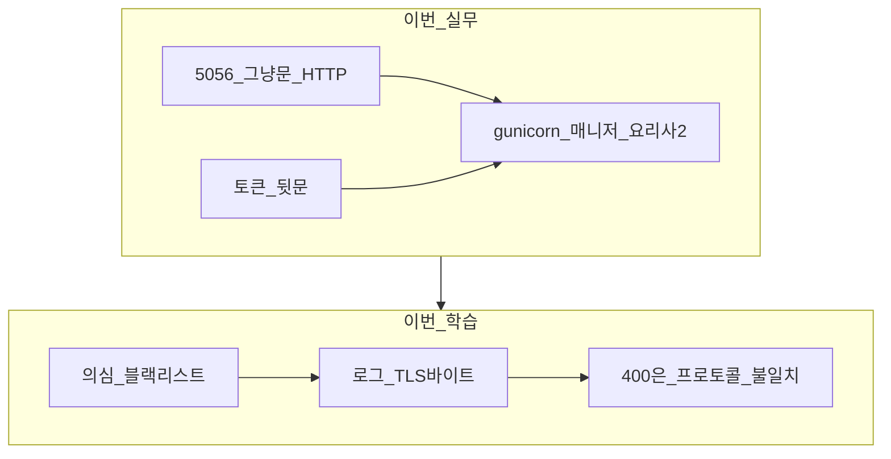
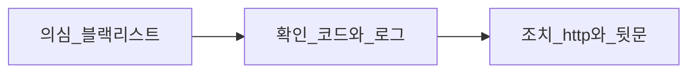
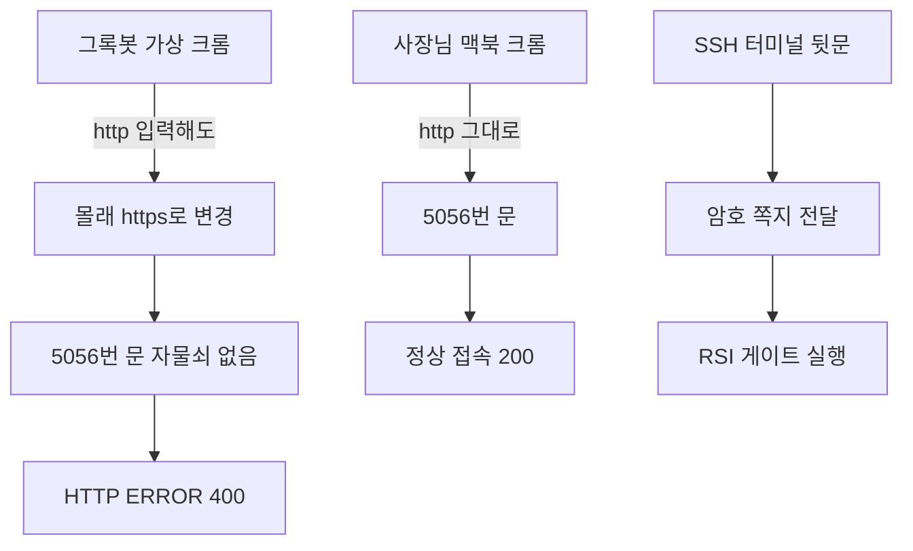

## 1. 도입 (Context & Goal)

한 줄로 말하면 이렇습니다.

> **아무것도 고장 나지 않았습니다.** 그록봇이 "잠긴 문"으로 들어오려 했는데, 가게 문에는 애초에 자물쇠가 없어서 문지기가 "무슨 소리인지 모르겠는데요?"라고 되돌려보낸 말이 화면에 `HTTP ERROR 400`으로 찍힌 것이다.
{: .wn-lede }

### 당시 목표
- 미국 주식 봇 대시보드(`5056`)가 이틀은 되고 3일째 `HTTP ERROR 400`이 난 이유를, 블랙리스트 의심부터 로그까지 좁히기
- "올렸으면 끝"이 아니라 **의심 → 확인 → 조치**로, 문지기(프로토콜)와 주방(앱 코드)을 분리해 보기
- 사람이 보는 정문과, 자동화가 쓰는 뒷문을 나눠 두기

### 등장인물

| 이름 | 실제 정체 | 비유 |
|---|---|---|
| **Hetzner 서버** | 독일 회사에서 빌린 컴퓨터 | 24시간 돌아가는 **내 가게 건물** |
| **대시보드** | 주식 봇 상태를 보는 웹페이지 | 가게 안의 **매장 홀** |
| **5056** | 포트 번호 | 건물의 **5056번 출입문** |
| **그록봇** | 자동으로 일해주는 AI | 대신 심부름 다니는 **알바생** |
| **HTTP / HTTPS** | 인터넷 대화 방식 2종류 | **그냥 문** / **자물쇠 달린 문** |

포트(Port)는 건물 하나의 문 번호다. "5000번 문은 코인 봇", "5056번 문은 미국 주식 봇"처럼 컴퓨터 한 대 안에서 출입구를 나눈다.

비유: 운영 중인 식당 정문은 손으로 미는 문인데, 알바생 회사 규칙이 "무조건 자물쇠 문으로만 다녀라"여서 열쇠를 허공에 꽂은 사건이다. 주방(RSI·로그인 코드)은 아직 주문서를 받기도 전에 문지기에게 되돌아갔다.



---

## 2. 트러블슈팅 (Micro-Debugging)

막힌 지점은 "대시보드 코드가 알바생을 차단해서"보다 **말하는 방식이 섞인 지점**이었습니다.

| 증상처럼 보이는 것 | 실제 원인에 가까운 것 |
|-------------------|----------------------|
| 이틀 되다가 3일째 `HTTP ERROR 400` | 출입 금지 명단이 아니라, 문지기가 손님 말을 못 알아들음 |
| 문을 너무 자주 여닫아서 블랙리스트 | 코드에 IP 차단·횟수 제한·fail2ban이 없음. 있는 건 비밀번호(토큰) 확인뿐 |
| 로그의 `\x16\x03\x01...` 와 `Bad request version` | **"자물쇠 열쇠를 꽂겠습니다"**(TLS 악수). 5056번 문에는 자물쇠 구멍이 없음 |
| 같은 맥북인데 어떤 때는 실패 | `03:03:15` https → 400, `03:03:28` http → 200. 13초 차이, 방식만 바뀜 |
| Hetzner `Object Storage in location HEL1 degraded` | 창고 대여 상품 장애. 우리가 쓰는 컴퓨터 대여와 다른 상품이라 서버 알림이 없는 게 정상 |
| 그록봇은 `http://`를 쳐도 400 | 가상 크롬이 뒤에서 몰래 `https://`로 바꿈. 자물쇠 없는 문에서는 그 습관이 방해 |

```text
code 400, message Bad request version
"\x16\x03\x01\x00\x8a\x01..." 400
```

`\x16\x03\x01`만 보면 된다. 문지기는 HTTP 문장만 받는데, 첫 마디가 TLS 악수라서 **400: 무슨 말인지 모르겠어요**가 났다. 그래서 로그인·RSI 코드는 구경도 못 했다. 앱을 아무리 뜯어도 원인이 안 나온 이유다.



---

## 3. 해결 과정 & 코드 (Solution)

### 3-1. 실무로 한 일 (Before / After)

**Before — 포장마차 (개발용 서버 1인)**

주방장 한 명이 주문·요리·서빙을 혼자 한다. 주식 분석(RSI)이 5분 걸리면 그 사이 다른 손님은 방치된다.

**After — 식당 (gunicorn) + CCTV + 뒷문**

1. **gunicorn 도입** — 매니저 1명 + 요리사 2명. 한 명이 긴 요리를 해도 다른 손님은 계속 응대한다. gunicorn은 손님을 받을 때 쓰는 서버 프로그램이고, 원래 쓰던 것은 개발자가 혼자 테스트할 때 쓰는 연습용이다.
2. **오류 기록** — 누가, 어떤 문으로, 왜 실패했는지 남긴다. 비밀번호는 기록하지 않는다.
3. **토큰 클라이언트** — 알바생이 정문 → 로그인 화면 → 버튼 클릭을 반복하지 않고, 암호 쪽지를 들고 뒷문으로 주방에 바로 전달한다.

확인된 가동 상태:

```text
Active: active (running)
Main PID: 144072 (매니저)
   ├─ 144078 (요리사 1)
   └─ 144079 (요리사 2)
Starting gunicorn 23.0.0
```

**사람(사장님)이 볼 때** — 주소의 `s`를 붙이지 않는다.

```text
http://77.42.64.226:5056/
```

**자동화(그록봇)가 일할 때** — 브라우저 대신 SSH로 서버에 들어가 뒷문을 쓴다. `YYYYMMDD`는 날짜를 넣으라는 빈칸이고, 당시 서버에 있던 파일은 `20260915`, `20260916`, `20260917`이다.

```bash
ssh trader@77.42.64.226
cd /home/trader/stock-auto-trading-lab
export US_SETTINGS_DASHBOARD_TOKEN='서버 env에 있는 그 비밀번호'
export US_DASHBOARD_BASE_URL=http://127.0.0.1:5056
python3 -m deploy_stock_long_lab.dashboard.ops_token_client universe-rsi-run \
  --file incoming/us_rsi_candidates_20260917.csv
```

작업이 끝나면 `unset US_SETTINGS_DASHBOARD_TOKEN`으로 화면의 비밀번호를 지운다.



---

### 3-2. 면접 연습 종합: 질문 → 내 답 → 점수 → 모범 답

이번 글의 압박 질문은 **셀프 점검**이다. 내 답·점수는 아직 없다. 모범 답만 복습용으로 채웠다.

#### 라운드 A — 워커를 늘리면 끝날까?

**질문 A1.** 요리사(worker)를 2명으로 늘렸는데, RSI 분석이 15분짜리 무거운 작업이 되고 사용자가 동시에 3명 붙으면 어떻게 될까? 요리사를 계속 늘리면 해결될까, 아니면 주문서를 받아두고 나중에 처리하는 방식(작업 큐)이 필요할까? 서버 메모리 관점에서 무엇이 먼저 터질까?

**내 답.** (아직 없음)

**점수.** (미채점)

**모범 답.** 요리사 2명이면 15분 작업 2개까지는 동시에 돌아가고, 3번째 손님의 긴 요리는 빈 요리사를 기다린다. 요리사를 계속 늘리면 각 프로세스가 앱을 통째로 들고 있어서 **메모리(RAM)가 먼저** 찬다. 긴 분석은 HTTP 요청 안에서 끝내지 말고, 주문서만 받아 큐에 넣은 뒤 워커가 나중에 처리하는 편이 문지기(웹)와 주방(분석)을 분리한다.

---

#### 라운드 B — 같은 문에서 http와 https

**질문 B1.** 같은 문(포트)에서 `http`와 `https`를 동시에 받을 수 없는 이유는 뭘까? IP만 있고 도메인이 없는 지금, 무료 인증서를 받으려면 뭐가 더 필요하고, 스스로 만든 인증서를 쓰면 그록봇 크롬은 어떤 새 화면에서 또 막힐까?

**내 답.** (아직 없음)

**점수.** (미채점)

**모범 답.** 문지기는 첫 바이트로 말을 고른다. HTTP는 글자(`GET /`)로 시작하고, HTTPS는 `\x16\x03\x01` 같은 TLS 악수로 시작한다. 자물쇠 구멍이 없는 서버는 그 첫 마디를 HTTP로 읽다가 400이 난다. 공개적으로 신뢰되는 무료 인증서(Let's Encrypt)는 보통 **도메인 이름**이 필요하다. IP만으로는 그 절차가 막힌다. 스스로 만든 인증서는 브라우저가 "이 자물쇠를 내가 모르는 사람이 만들었다"며 연결 경고 화면에서 다시 멈춘다. 최종 목표는 도메인 + 진짜 `https`다. IP의 HTTP는 임시 정문이다.

---

### 3-3. 점수 한눈에

| 라운드 | 주제 | 점수(대략) | 한 줄 피드백 |
|--------|------|------------|--------------|
| A1 | 워커 vs 작업 큐 | 미채점 | 늘리기 전에 RAM, 긴 작업은 큐 |
| B1 | http/https와 인증서 | 미채점 | 첫 바이트가 말을 고른다. IP HTTP는 임시 |

성장 곡선: 처음엔 "자주 열어서 블랙리스트"로 의심했고, 코드를 비운 뒤 로그의 `\x16\x03\x01`과 13초 간격의 400/200으로 **문지기 문제**까지 좁혔다. 남은 과제는 셀프 점검 두 질문에 내 답을 적고, 정문을 도메인 + https로 바꾸는 것이다.

---

## 4. 딥다이브 (What I Learned)

### Framework Deep-Dive
웹 서버는 3단 체크를 거친다. ① 문지기가 "이게 사람 말인가?" 확인 → ② 어느 방 손님인지 주소 확인 → ③ 그 방에서 일 처리. 이번 400은 ①번 탈락이라 우리가 만든 로그인·RSI 코드는 실행되지 않았다. gunicorn은 그 문지기·응대를 매니저와 요리사 프로세스로 나누는 실서비스용 서버다.

### Performance & Memory (리스크)
1인 체제는 병목(Bottleneck, 좁은 통로에서 길이 막히는 현상)이 생긴다. RSI가 5분이면 그 5분간 모니터 새로고침도 멈춘다. 요리사 2명이면 한 명의 긴 작업 중에도 나머지가 응대한다. 워커를 무한정 늘리면 프로세스마다 메모리를 쓰므로, 긴 분석은 큐로 빼는 쪽이 먼저 검토할 지점이다.

### Industry Convention
개발용 서버를 실서비스에서 gunicorn으로 바꾼 것, 비밀번호를 명령어 본문이 아닌 환경변수로 받는 것은 현장의 기본에 가깝다. IP만 열고 HTTP만 쓰는 것은 임시방편이다. 도메인과 무료 인증서로 진짜 `https`를 붙이는 것이 정문의 다음 단계다. 위험한 값(토큰)은 기록·화면에 남기지 않고, 끝나면 `unset`한다.

### 주니어 실전 팁 3가지
1. 400이 "앱이 거절했다"로 보이면, 먼저 로그 첫 바이트가 HTTP인지 TLS(`\x16`)인지 본다.
2. 같은 시각에 http 200 / https 400이 있으면 블랙리스트보다 **프로토콜**을 의심한다.
3. 브라우저가 `http`를 `https`로 바꾸면, 자동화는 브라우저 대신 서버 안 뒷문(`127.0.0.1`)을 쓴다.

풀어쓴 설명: [주니어 실전 팁 3가지 — 첫 바이트, 13초 대조, 건물 안 뒷문](/http/junior-tips-first-byte-and-loopback/)
