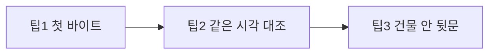
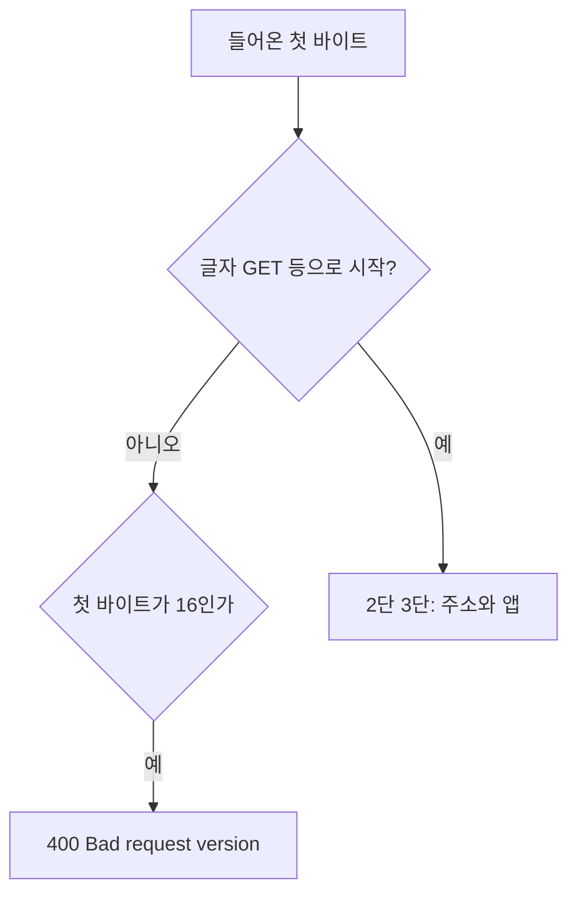

원문: [자물쇠 없는 5056번 문에 https를 꽂아 400이 난 기록](/http/http-400-https-on-plain-port/)

단어 사전: [HTTP × HTTPS × TLS × gunicorn 학습 페이지](/http/learn-http-https-gunicorn-tls/)

## 1. 도입 (Context & Goal)

한 줄로 말하면 이렇습니다.

> 팁 3개는 서로 다른 기술이 아니라 **의심 → 확인 → 조치** 한 줄이다. 앱이 쫓아낸 것처럼 보여도, 로그 첫 글자가 주문 쪽지인지 자물쇠 도장인지 보고, 같은 사람이 글자로 말하면 통과하는지 대조한 뒤, 자동 심부름은 거리의 브라우저 대신 건물 안 뒷문으로 보낸다.
{: .wn-lede }

### 당시 목표
- 원문 맨 아래 팁 3줄을, 실제 로그 바이트와 시각까지 풀어서 다시 설명할 수 있게 하기
- “400 = 우리 코드가 거절”이라는 첫 추측을, 문지기 단계에서 멈추게 하기
- 그록봇 브라우저가 `http`를 `https`로 바꿔도, 서버 안 `127.0.0.1`은 왜 다른 문인지 구분하기

비유: 식당 문 앞에서 손님이 쫓겨났다. 주방 레시피를 고치기 전에 CCTV의 **첫 장면**을 본다. 손에 종이 주문서가 있는지, 자물쇠 열쇠가 있는지. 같은 손님이 13초 뒤 종이만 들고 들어오면 출입 금지 명단이 아니다. 알바 심부름은 거리 정문을 두드리지 말고, 건물 안에서 주방 옆문으로 쪽지를 넣는다.



---

## 2. 트러블슈팅 (Micro-Debugging)

원문 로그는 이 한 줄이다.

```text
code 400, message Bad request version
"\x16\x03\x01\x00\x8a\x01..." 400
```

| 팁 | 증상처럼 보이는 것 | 이 로그에서 확인되는 것 |
|----|-------------------|-------------------------|
| 1. 첫 바이트 | 대시보드가 손님을 거절했다 | 첫 바이트 `\x16`은 글자 `GET`이 아니다. HTTP 해석기가 버전 줄을 못 찾아 `Bad request version` |
| 2. 같은 시각 대조 | 자주 와서 블랙리스트 | `03:03:15` https → 400, `03:03:28` http → 200. 같은 맥북, 13초, 말만 바뀜 |
| 3. 뒷문 | 주소만 `http://`면 브라우저가 지켜 준다 | 그록봇 가상 크롬은 공개 IP `5056`에 TLS를 보냈고 400이 났다. 자동화는 브라우저를 빼고 `127.0.0.1:5056`으로 간다 |

웹 서버의 3단 체크에서 이번 400은 ①번이다. ① 이 말이 주문 쪽지인가 → ② 어느 방인가 → ③ 로그인·RSI. `\x16`이면 ①에서 끝나서, 대시보드 비밀번호 함수는 실행되지 않는다.



---

## 3. 해결 과정 & 코드 (Solution)

### 3-1. 팁별로 로그를 읽어 보기 (Before / After)

**Before — 팁을 적용하기 전**

```text
화면에 HTTP ERROR 400
→ 대시보드 코드를 처음부터 뒤진다
→ 블랙리스트가 있는지 의심한다
```

**After — 팁 순서**

```text
1. 로그 첫 바이트가 \x16 인지 본다
2. 같은 시각 http 200 이 있는지 본다
3. 자동화는 127.0.0.1 로 보낸다
```

#### 팁 1 — 첫 바이트가 도장이다

편지에는 맨 앞에 도장이 있다. [RFC 8446](https://datatracker.ietf.org/doc/html/rfc8446)에서 내용 종류 `22`, 즉 16진수 `0x16`은 **악수(handshake)** 다. 주문서가 아니라 “자물쇠 이야기를 시작하자”는 봉투다.

이번 로그를 도장 칸으로 나누면 이렇다.

| 바이트 | 값          | 가게 말                                                                       |
| --- | ---------- | -------------------------------------------------------------------------- |
| 1   | `\x16`     | 도장: 악수. 10진수 22                                                            |
| 2–3 | `\x03\x01` | 봉투에 적힌 옛 버전 표시. TLS 1.0(3,1)처럼 보이게 적어 옛 문지기와 맞춘다. 실제로 협상된 최종 버전과 항상 같지는 않다 |
| 4–5 | `\x00\x8a` | 이 악수 내용의 길이. 16진수 8a는 10진수 138                                             |
| 6   | `\x01`     | 악수 내용의 종류가 ClientHello, 즉 “손님이 먼저 안녕하세요”                                   |

HTTP 주문 쪽지의 첫 글자는 알파벳이다. `GET`의 `G`는 `\x47`이다. `\x16`은 키보드로 치는 글자가 아니라서, 글자 문지기는 첫 줄을 `HTTP/1.1` 같은 버전으로 읽지 못한다. 그래서 상태 코드가 400이고, 메시지가 `Bad request version`이다.

이 한 칸만 봐도 주방(로그인, RSI)을 열 필요가 없다. 문이 기대한 말은 `GET / HTTP/1.1`이고, 도착한 말은 자물쇠 악수다.

#### 팁 2 — 같은 사람이 13초 뒤에 통과하면 명단이 아니다

출입 금지 명단은 **사람**을 막는다. 말의 종류를 바꾸면 둘 다 막히거나, 둘 다 통과해야 자연스럽다.

원문 CCTV:

```text
03:03:15  https  →  400
03:03:28  http   →  200
```

같은 맥북이다. 사이에 코드를 고친 기록도 없다. 바뀐 것은 `s` 하나, 즉 자물쇠 말을 했는가뿐이다. 200은 “글자 주문은 이 문이 알아듣는다”는 대조군이다. 그래서 의심의 순서가 블랙리스트에서 **프로토콜(말하는 방식)** 으로 바뀐다.

코드 검색도 같은 결론이었다. IP를 막는 줄, “너무 자주 오면 차단”하는 줄, fail2ban 같은 경비 프로그램은 없었고, 비밀번호(토큰) 확인만 있었다. 그 확인은 ①번을 통과한 뒤에야 돌아간다.

#### 팁 3 — 브라우저는 정문 습관이 있고, 127.0.0.1은 건물 안이다

`127.0.0.1`은 루프백이다. 편지 주소가 “이 건물 안 나에게”라서, 거리(인터넷)로 나가지 않는다. 자동화 명령이 이 주소를 쓰는 이유다.

```bash
export US_DASHBOARD_BASE_URL=http://127.0.0.1:5056
```

이 줄은 SSH로 **서버 안에 들어간 다음** 실행한다. 쪽지가 독일 서버의 거리 문(`77.42.64.226:5056`)을 두드리지 않고, 그 컴퓨터 안의 5056번 문을 두드린다.

브라우저 쪽은 다르다. 크롬 계열에는 HTTP 주소를 HTTPS로 올리려는 습관(HTTPS-Upgrades)이 있다. 크롬 소스의 업그레이드 가로채기는 **localhost와 루프백은 거리로 나가지 않으니 올리기 대상에서 뺀다**고 적혀 있다. 공개 IP는 그 예외가 아니다. 이번 사건에서 그록봇 가상 크롬은 주소창에 `http://`를 넣어도 공개 IP `5056`으로 TLS(`\x16`)를 보냈고, 자물쇠 없는 문지기가 400을 냈다.

그래서 조치는 두 갈래다.

- **사람**이 볼 때: 맥북 주소는 `http://77.42.64.226:5056/` 처럼 `s` 없이 연다. 이 브라우저가 http를 그대로 두면 200이 난다.
- **자동화**가 일할 때: 가상 크롬으로 정문을 두드리지 않는다. SSH 뒤 `http://127.0.0.1:5056`과 토큰 쪽지를 쓴다. 브라우저의 “무조건 자물쇠” 습관을 경로에서 빼는 것이다.

gunicorn 요리사 수를 늘리는 일은 이 400을 지우지 않는다. 요리사는 ①번을 통과한 주문을 나누는 인원이다.

---

### 3-2. 면접 연습 종합: 질문 → 내 답 → 점수 → 모범 답

셀프 점검이다. 내 답은 비워 둔다.

#### 라운드 A — 첫 바이트로 수사 범위를 자르기

**질문 A1.** 로그가 `\x16\x03\x01...` 과 `Bad request version`이면, 로그인 토큰 검사 함수에 브레이크포인트를 거는 것이 왜 한 번도 멈추지 않을 수 있나? 그때 먼저 열어볼 한 칸은 어디인가?

**내 답.** (아직 없음)

**점수.** (미채점)

**모범 답.** 문지기가 첫 바이트를 HTTP 요청 줄로 읽다가 버전을 못 찾아 400으로 끝낸다. 토큰 검사는 3단 체크의 ③이라 호출되지 않는다. 먼저 볼 칸은 로그의 첫 바이트가 `\x47`(G, 즉 GET)인지 `\x16`(악수)인지다.

#### 라운드 B — 뒷문이 정문 400을 지우지 않는 이유

**질문 B1.** `US_DASHBOARD_BASE_URL=http://127.0.0.1:5056` 으로 RSI가 성공해도, 그록봇 브라우저의 `http://77.42.64.226:5056/` 은 계속 400일 수 있다. 어느 문에서 말이 갈라지고, 공개 정문을 브라우저로도 안전하게 쓰려면 무엇이 더 필요한가?

**내 답.** (아직 없음)

**점수.** (미채점)

**모범 답.** 뒷문은 서버 안 루프백이고, 브라우저는 거리의 공개 IP로 TLS를 보낸다. 성공한 쪽은 글자 HTTP가 통하는 안쪽 문이다. 공개 정문을 브라우저로 안전하게 쓰려면 그 문이 ClientHello를 받도록 도메인과 인증서(TLS)를 달아야 한다. 워커를 더 두는 것으로는 첫 바이트가 바뀌지 않는다.

---

### 3-3. 점수 한눈에

| 라운드 | 주제 | 점수(대략) | 한 줄 피드백 |
|--------|------|------------|--------------|
| A1 | `\x16`이면 앱 함수 이전 | 미채점 | 브레이크포인트보다 첫 바이트 |
| B1 | 루프백 성공은 정문 400을 지우지 않음 | 미채점 | 문이 두 개다. 정문에는 TLS가 따로 필요 |

성장 곡선: 팁을 “외울 문장 3개”로 두지 않고, 한 로그에서 ① 도장(`\x16`) ② 대조(13초 뒤 200) ③ 경로 분리(`127.0.0.1`)로 읽을 수 있으면 된다.

---

## 4. 딥다이브 (What I Learned)

### Framework Deep-Dive
HTTP 문지기는 첫 줄을 `GET / HTTP/1.1` 같은 글자로 기대한다. TLS는 그 전에 레코드 헤더를 보내고, 내용 종류 22(`\x16`)가 악수다. 초기 ClientHello 레코드는 옛 문지기와 맞추려고 버전 표시를 `0x0301`로 두는 경우가 많다. 그래서 `\x16\x03\x01`은 “TLS 1.0만 쓴다”는 확정이 아니라 “악수 봉투를 옛 형식으로 열었다”에 가깝다. 그 뒤 `\x01`이 ClientHello다.

### Performance & Memory (리스크)
이 400은 CPU나 메모리로 느려진 증상이 아니다. 요청이 앱에 들어가기 전에 끊긴다. gunicorn 워커를 늘리면 통과한 요청의 대기만 줄어든다. `\x16` 요청은 워커의 파이썬 함수까지 가지 못하므로, 인원을 늘려도 400 횟수는 그대로다. 수사를 앱 전체 검색으로 시작하면 시간만 쓴다.

### Industry Convention
장애 로그에서는 상태 코드 숫자보다 **거절 메시지와 첫 바이트**를 같이 본다. `Bad request version`은 “버전 협상 실패”라는 앱 정책이 아니라, 요청 줄 파싱 실패에 가깝다. 자동화는 브라우저의 HTTPS 업그레이드에 기대지 않고, 서버 안 루프백처럼 업그레이드 예외에 들어가는 주소를 쓰거나, 공개 문에는 진짜 인증서를 단다. 토큰은 명령어 본문에 붙이지 않고 환경변수로 넘긴 뒤 `unset`한다.

### 주니어 실전 팁 3가지
1. 400의 첫 바이트가 `\x16`이면 앱 거절이 아니다. `\x47`처럼 알파벳으로 시작할 때 앱을 연다.
2. 같은 손님의 http 200과 https 400이 나란히 있으면 명단보다 말의 종류를 의심한다.
3. 브라우저가 공개 IP의 `http`를 `https`로 바꾸면, 자동화는 그 브라우저를 빼고 `127.0.0.1`로 간다.

### 확인에 쓴 자료
- 원문 로그 `\x16\x03\x01\x00\x8a\x01` 과 `03:03:15` / `03:03:28` 대조
- [RFC 8446 — TLS 1.3](https://datatracker.ietf.org/doc/html/rfc8446) (내용 종류 handshake = 22, 초기 ClientHello 레코드 버전 `0x0301`)
- [RFC 8448 — TLS 1.3 악수 예시](https://datatracker.ietf.org/doc/html/rfc8448) (기록 시작 `16 03 01`)
- [Chromium HTTPS-Upgrades](https://chromium.googlesource.com/chromium/src/+/refs/heads/main/chrome/browser/ssl/https_upgrades_interceptor.cc) (localhost·루프백은 업그레이드에서 제외)
