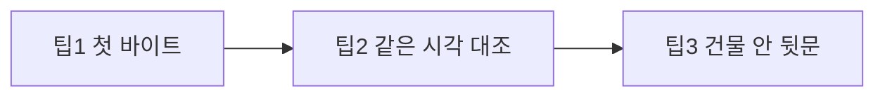
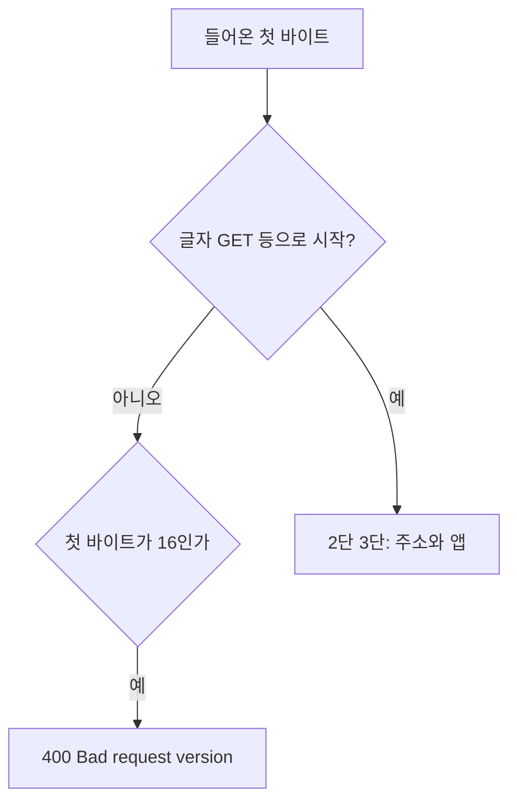

이 글은 [문제 발생에서 문제 해결까지](/http/grok-terminal-api-not-ssh/)의 원인 확인 다음에 이어집니다. 다음 글은 [HTTP·HTTPS·TLS·gunicorn 학습](/http/learn-http-https-gunicorn-tls/)입니다.

중심 글이 `journalctl`로 찾은 줄을, 여기서는 바이트와 시각으로 읽는다. 토큰 함수 전문은 중심 글에 있다.

## 1. 도입 (Context & Goal)

> 400이 앱의 거절처럼 보여도, 먼저 로그 첫 글자, 같은 시각의 200, 그다음 문의 종류를 본다.
{: .wn-lede }



## 2. 트러블슈팅 (Micro-Debugging)

```text
code 400, message Bad request version
"\x16\x03\x01\x00\x8a\x01..." 400
```

`\x16`이면 ① “이 말이 주문 쪽지인가”에서 끝난다. ② 어느 방인지, ③ 로그인·RSI는 호출되지 않는다.



## 3. 해결 과정 & 코드 (Solution)

### 3-1. 팁별로 로그를 읽어 보기 (Before / After)

**Before**

```text
화면에 HTTP ERROR 400
→ 대시보드 코드를 처음부터 뒤진다
→ 블랙리스트가 있는지 의심한다
```

**After**

```text
1. 로그 첫 바이트가 \x16 인지 본다
2. 같은 시각 http 200 이 있는지 본다
3. 자동화는 127.0.0.1 로 보낸다
```

#### 팁 1 — 첫 바이트

[RFC 8446](https://datatracker.ietf.org/doc/html/rfc8446)에서 내용 종류 `22`, 16진수 `0x16`은 **악수(handshake)** 다.

| 바이트 | 값 | 가게 말 |
| --- | --- | --- |
| 1 | `\x16` | 도장: 악수. 10진수 22 |
| 2–3 | `\x03\x01` | 봉투의 옛 버전 표시. TLS 1.0(3,1)처럼 보이게 적어 옛 문지기와 맞춘다. 협상된 최종 버전과 항상 같지는 않다 |
| 4–5 | `\x00\x8a` | 악수 내용 길이. 16진수 8a는 10진수 138 |
| 6 | `\x01` | ClientHello. “손님이 먼저 안녕하세요” |

`GET`의 `G`는 `\x47`이다. `\x16`은 글자가 아니라서 문지기가 `HTTP/1.1`을 못 찾고 `Bad request version`을 낸다.

#### 팁 2 — 같은 사람이 13초 뒤에 통과하면 명단이 아니다

출입 금지는 **사람**을 막는다. 말만 바꿨는데 통과하면 명단이 아니다.

```text
03:03:15  https  →  400
03:03:28  http   →  200
```

같은 맥북이고, 그 13초에 코드를 고친 기록은 없다. 바뀐 것은 `s` 하나다. 200은 “글자 주문은 이 문이 알아듣는다”는 대조다.

#### 팁 3 — 127.0.0.1은 건물 안이다

`127.0.0.1`은 루프백이다. 편지 주소가 “이 건물 안 나에게”라서 거리로 나가지 않는다.

```bash
export US_DASHBOARD_BASE_URL=http://127.0.0.1:5056
```

이 주소는 SSH로 **서버 안에 들어간 다음** 쓴다. 공개 IP의 5056을 두드리지 않는다.

크롬의 HTTPS-Upgrades는 localhost와 루프백을 올리기 대상에서 뺀다. 거리로 나가지 않기 때문이다. 공개 IP는 그 예외가 아니다. 그록 가상 크롬은 `http://`를 쳐도 공개 IP `5056`에 `\x16`을 보냈고, 그 문이 400을 냈다.

그래서 사람이 맥북에서 볼 때는 `http://`에 `s`를 붙이지 않는다. 자동화는 그 브라우저를 빼고, 중심 글처럼 그록 PC의 `curl`을 쓰거나 서버 안 `127.0.0.1`을 쓴다.

### 3-2. 면접 연습 종합: 질문 → 내 답 → 점수 → 모범 답

#### 라운드 A — 첫 바이트로 수사 범위를 자르기

**질문 A1.** 로그가 `\x16\x03\x01...`과 `Bad request version`이면, 로그인 토큰 함수에 브레이크포인트를 걸어도 왜 한 번도 멈추지 않을 수 있나? 먼저 볼 칸은 어디인가?

**모범 답.** 첫 바이트를 HTTP 요청 줄로 읽다가 버전을 못 찾아 400으로 끝낸다. 토큰 검사는 ③이라 호출되지 않는다. 볼 칸은 `\x47`(G, GET)인지 `\x16`(악수)인지다.

#### 라운드 B — 뒷문이 정문 400을 지우지 않는 이유

**질문 B1.** `http://127.0.0.1:5056`으로 RSI가 돼도, 브라우저의 공개 IP는 400일 수 있다. 어느 문의 말이 갈라지고, 공개 정문에는 무엇이 더 필요한가?

**모범 답.** 뒷문은 루프백의 글자 HTTP다. 브라우저는 공개 IP로 TLS를 보낸다. 공개 정문이 ClientHello를 받으려면 도메인과 인증서가 필요하다. 워커를 더 둬도 첫 바이트는 바뀌지 않는다.

## 4. 딥다이브 (What I Learned)

### Framework Deep-Dive

초기 ClientHello 레코드는 옛 문지기와 맞추려고 버전 표시를 `0x0301`로 두는 경우가 많다. `\x16\x03\x01`은 “TLS 1.0만 쓴다”는 확정이 아니라 “악수 봉투를 옛 형식으로 열었다”에 가깝다. 여섯 번째 `\x01`이 ClientHello다.

### Performance & Memory (리스크)

이 400은 CPU가 느려서 난 증상이 아니다. 요청이 앱에 들어가기 전에 끊긴다. 앱 전체를 먼저 뒤지면 시간만 쓴다.

### Industry Convention

`Bad request version`은 앱의 버전 협상 정책이 아니라, 요청 줄 파싱 실패에 가깝다. 상태 코드 숫자와 첫 바이트를 같이 본다.

### 확인에 쓴 자료

- [RFC 8446 — TLS 1.3](https://datatracker.ietf.org/doc/html/rfc8446) (handshake = 22, 초기 ClientHello 레코드 버전 `0x0301`)
- [RFC 8448 — TLS 1.3 악수 예시](https://datatracker.ietf.org/doc/html/rfc8448) (기록 시작 `16 03 01`)
- [Chromium HTTPS-Upgrades](https://chromium.googlesource.com/chromium/src/+/refs/heads/main/chrome/browser/ssl/https_upgrades_interceptor.cc) (localhost·루프백은 업그레이드에서 제외)
