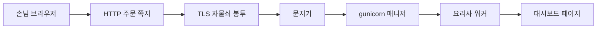
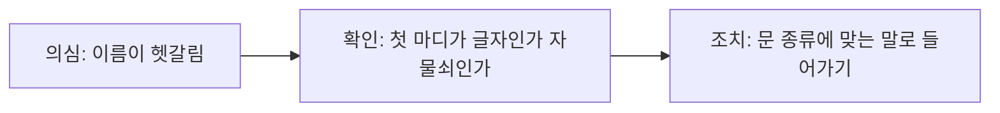

이 글은 [문제 발생에서 문제 해결까지](/http/grok-terminal-api-not-ssh/)의 문제 해결 다음에 이어집니다. 정리로 돌아가려면 [그 글](/http/grok-terminal-api-not-ssh/)을 보면 됩니다.

관련 기록: [자물쇠 없는 5056번 문에 https를 꽂아 400이 난 기록](/http/http-400-https-on-plain-port/)

## 1. 도입 (Context & Goal)

한 줄로 말하면 이렇습니다.

> 웹은 **주문 쪽지(HTTP)** 를 주고받는 식당이고, **자물쇠 봉투(TLS)** 에 넣으면 주소가 `https`가 된다. **gunicorn**은 그 식당의 매니저와 요리사다. 쪽지 문에 자물쇠 말을 하면 주방까지 가기 전에 `400`이 난다.
{: .wn-lede }

### 당시 목표
- 블로그 태그 `http`, `https`, `gunicorn`, `tls`를 비전공자와 어린이도 다시 설명할 수 있게 만들기
- 지난 글의 `HTTP ERROR 400`이 요리 실패가 아니라 **문지기 실패**인 이유를 네 단어로 연결하기
- 외울 정의 대신, 가게에서 누가 무엇을 하는지로 남기기

비유: 식당에 세 역할이 있다. 손님이 종이에 주문을 쓴다(HTTP). 소중한 주문은 자물쇠 봉투에 넣는다(TLS). 홀에는 매니저가 있고, 주방에는 요리사가 있다(gunicorn). 자물쇠 봉투를 받을 준비가 안 된 문지기는 봉투를 종이 주문으로 읽다가 돌려보낸다.



---

## 2. 트러블슈팅 (Micro-Debugging)

이번 페이지의 “고장”은 버그 한 줄보다 **이름이 섞이는 지점**이다.

| 증상처럼 보이는 것                  | 실제에 가까운 것                                                    |
| --------------------------- | ------------------------------------------------------------ |
| HTTPS는 HTTP와 전혀 다른 언어       | HTTPS는 **HTTP를 TLS 위에 올린 것**이다. 주문서 양식은 같고, 운반 봉투만 다르다       |
| TLS와 SSL은 다른 자물쇠 두 개        | SSL은 예전 이름이다. 지금 쓰는 자물쇠는 TLS다. 인증서를 아직도 SSL 인증서라고 부르는 경우가 많다 |
| `https://`만 치면 어떤 문이든 안전해진다 | 그 문이 **자물쇠 악수를 받을 준비**가 되어 있어야 한다. 준비 안 된 문은 400이 난다         |
| 400은 비밀번호가 틀려서              | 400번대는 “손님 쪽 말이 이상하다”는 쪽이다. 이번 400은 주방 비밀번호 확인 **전에** 났다     |
| gunicorn을 켜면 자물쇠가 생긴다       | gunicorn은 손님을 받아 파이썬 앱을 부르는 **식당 운영**이다. 자물쇠(TLS)는 따로 달아야 한다 |
| 요리사를 많이 두면 무조건 빠르다          | 기본 요리사 1명은 주문 1개만 한다. 사람을 늘리면 메모리도 같이 늘어 주방이 비좁아질 수 있다       |

문지기가 기대하는 첫 마디가 다르다. 그냥 문(HTTP)은 `GET / ...`처럼 **글자 주문**으로 시작한다. 자물쇠 문(HTTPS)은 암호 악수인 **ClientHello**로 시작한다. 지난 로그의 `\x16\x03\x01`은 그 악수의 시작 신호다. 글자 문지기는 그 신호를 주문서로 읽지 못하고 `Bad request version`, 즉 400을 낸다.



---

## 3. 해결 과정 & 코드 (Solution)

### 3-1. 네 단어를 가게 순서로 보기 (Before / After)

**Before — 이름만 외운 상태**

```text
http, https, tls, gunicorn  →  약자 네 개
```

**After — 누가 무엇을 하는지**

```text
손님 쪽지(HTTP) → 자물쇠 봉투(TLS) → 주소창의 https
접수 매니저 + 요리사(gunicorn) → 파이썬 대시보드
```

#### HTTP — 주문 쪽지

HTTP는 웹에서 자료를 달라고 **손님이 먼저** 말을 거는 약속이다. 브라우저가 손님이고, 서버가 식당이다. 손님이 쪽지를 보내고, 식당이 답장을 준다. 둘 사이에 “지금 몇 번째 손님이었지?”를 서버가 자동으로 기억하지는 않는다. 그래서 HTTP를 상태가 없는 대화라고 한다. 로그인 기억은 나중에 쿠키 같은 추가 쪽지로 붙인다.

쪽지는 크게 두 장이다.

- **요청**: “이거 주세요.” `GET`은 메뉴를 가져오기, `POST`는 주문서(입력값)를 맡기기.
- **응답**: “여기 있습니다” 또는 “그 말 못 알아듣겠어요.” 숫자 상태 코드가 붙는다.

어린이용 상태 코드 세 개만 기억하면 된다.

| 코드 | 가게 말 | 뜻 |
|------|---------|----|
| 200 | 주문 나왔습니다 | 성공 |
| 400 | 주문서가 식당 말이 아닙니다 | 손님 쪽 형식 오류 |
| 404 | 그 메뉴는 없습니다 | 주소는 왔지만 방이 없음 |

최소 쪽지 모양은 이렇다.

```text
GET / HTTP/1.1
Host: 77.42.64.226:5056
```

`5056`은 건물 문 번호다. 잘 알려진 기본 문은 HTTP가 80번, HTTPS가 443번이다. 우리 대시보드는 그 기본 문 대신 **5056번 그냥 문**을 연 것이다.

#### TLS — 자물쇠 봉투

TLS는 인터넷으로 지나가는 대화를 지키는 자물쇠 약속이다. 웹에서만 쓰는 것은 아니고, 메일 같은 다른 대화에도 쓸 수 있다. 웹에서는 세 가지를 지킨다.

1. **남이 못 읽게** — 길에서 봉투를 열어도 주문이 안 보인다. (암호화)
2. **몰래 못 고치게** — 길에서 “피자”를 “빈 접시”로 바꾸면 들킨다. (무결성)
3. **식당이 맞는지** — 간판을 베낀 가게가 아니라, 인증서에 적힌 그 가게인지 확인한다. (인증)

인증서는 가게 신분증이다. 신뢰하는 기관이 “이 도메인의 주인”이라고 적어 준다. 도메인 없는 IP만으로는 그 신분증을 받기 어렵다. 그래서 지난 글의 정문은 아직 그냥 문(HTTP)이다.

자물쇠를 채우기 직전, 손님과 식당은 짧게 맞춘다. 이걸 TLS 악수라고 한다. 첫 신호가 `\x16`으로 시작하면 “지금 자물쇠 이야기를 시작한다”는 뜻이다.

#### HTTPS — 쪽지를 봉투에 넣은 것

HTTPS는 새 주문 언어가 아니다. **같은 HTTP 쪽지를 TLS 봉투에 넣어** 보내는 것이다. 주소는 `http` 대신 `https`로 시작한다. 기본 문 번호는 443이다.

그래서 이런 그림이 된다.

```text
https  =  HTTP 주문 쪽지  +  TLS 자물쇠 봉투
```

브라우저가 주소창의 `http://`를 몰래 `https://`로 바꾸는 일이 있다. 보안 습관으로는 착하지만, **봉투를 받을 구멍이 없는 5056번 문**에서는 400이 된다. 맥북에서 `http://`로 열면 200, 그록봇이 `https://`로 바꾸면 400이었던 이유가 이것이다.

#### gunicorn — 매니저와 요리사

파이썬 앱(대시보드)은 요리 레시피다. 레시피만으로는 건물 문을 열고 손님 쪽지를 읽지 못한다. gunicorn이 그 사이를 맡는다.

- **매니저(arbiter)**: 요리사 수를 지키고, 쓰러지면 다시 세운다. 손님 접시를 직접 만지지 않는다.
- **요리사(worker)**: 쪽지를 읽어 파이썬 함수를 부르고, 나온 결과를 다시 쪽지(응답)로 보낸다.
- **WSGI**: 홀과 주방이 주문을 주고받는 **정해진 양식**이다. gunicorn이 `app(environ, start_response)`처럼 앱을 부른다.

기본 요리사(sync worker)는 **한 번에 주문 1개**다. 지난 글에서 요리사를 2명으로 둔 이유는, RSI처럼 오래 걸리는 요리 중에도 다른 손님이 문 앞에서 얼지 않게 하려는 것이다. gunicorn 문서는 워커 수를 보통 CPU 코어당 2~4명부터 본다고 한다. 한 명 더 뽑을 때마다 앱을 통째로 드는 프로세스가 생겨 메모리가 늘어난다.

gunicorn을 켰다는 사실만으로 TLS 구멍이 생기지는 않는다. 지난 서버 로그의 `Starting gunicorn 23.0.0`은 “식당 운영을 바꿨다”는 뜻이지 “자물쇠를 달았다”는 뜻이 아니다.

---

### 3-2. 면접 연습 종합: 질문 → 내 답 → 점수 → 모범 답

학습용 셀프 점검이다. 내 답은 비워 두었다.

#### 라운드 A — 400은 어느 단계에서 났나?

**질문 A1.** 대시보드에 로그인 비밀번호 검사가 있는데, 왜 그 코드를 고쳐도 이번 400이 안 사라질 수 있나?

**내 답.** (아직 없음)

**점수.** (미채점)

**모범 답.** HTTP 서버는 먼저 “이 말이 주문 쪽지인가”를 본다. `\x16`으로 시작하는 TLS 악수는 쪽지가 아니라서, 방 주소 확인과 비밀번호 검사까지 가지 못한다. 고칠 곳은 로그인 함수가 아니라 **문 종류(http인지 https인지)** 다.

#### 라운드 B — 워커를 늘리면 자물쇠가 해결되나?

**질문 B1.** 요리사를 10명으로 늘리고 gunicorn을 재시작하면, 그록봇의 `https://아이피:5056` 400이 사라지나? 안 사라진다면 무엇이 먼저 필요한가?

**내 답.** (아직 없음)

**점수.** (미채점)

**모범 답.** 안 사라진다. 워커는 이미 통과한 주문을 나누는 주방 인원이다. 400은 주문이 주방 대기열에 들어가기 **전**이다. 먼저 필요한 것은 그 문이 TLS 악수를 받게 하는 일(도메인과 인증서)이거나, 자동화는 브라우저 대신 서버 안 `http://127.0.0.1:5056` 뒷문을 쓰는 일이다.

---

### 3-3. 점수 한눈에

| 라운드 | 주제 | 점수(대략) | 한 줄 피드백 |
|--------|------|------------|--------------|
| A1 | 400은 문지기 단계 | 미채점 | 비밀번호 코드는 아직 실행되지 않음 |
| B1 | gunicorn은 TLS가 아님 | 미채점 | 인원 충원으로 자물쇠가 생기지 않음 |

성장 곡선: 네 약자를 한 줄로 말할 수 있으면 이번 페이지의 목표에 닿은 것이다. “HTTP는 쪽지, TLS는 봉투, HTTPS는 쪽지+봉투, gunicorn은 매니저와 요리사.”

---

## 4. 딥다이브 (What I Learned)

### Framework Deep-Dive
MDN 기준으로 HTTP는 손님이 먼저 요청을 보내고 서버가 응답하는 약속이다. 세션은 연결을 열고, 요청을 보내고, 상태 코드와 본문이 담긴 응답을 받는 흐름이다. Cloudflare와 RFC 2818 기준으로 HTTPS는 그 HTTP를 TLS 위에서 쓰는 것이며, 기본 포트 443에서 서버가 기대하는 첫 데이터는 주문 줄이 아니라 ClientHello다. gunicorn 설계 문서 기준으로 매니저 프로세스는 워커를 관리할 뿐 손님 소켓을 직접 다루지 않고, 기본 sync 워커는 요청을 한 번에 하나씩 처리한다.

### Performance & Memory (리스크)
sync 워커 1명이 긴 RSI를 붙잡으면 그 워커는 다른 새로고침을 못 받는다. 워커를 늘리면 동시에 붙잡을 수 있는 긴 요리가 늘어나지만, 프로세스마다 앱 메모리를 쓴다. TLS 악수는 주방 속도 문제가 아니라 문지기 문제라서, 워커 수로 400을 줄일 수 없다.

### Industry Convention
실서비스에서 “개발용으로 혼자 받던 서버”를 gunicorn 같은 프로세스 매니저로 바꾸는 것은 흔한 다음 단계다. 그다음 정석은 도메인과 공개 인증서로 HTTPS를 붙이는 것이다. IP만 연 HTTP는 임시 출입문이다. 인증서를 아직 SSL 인증서라고 불러도, 실제 대화 약속은 TLS다.

### 주니어 실전 팁 3가지
1. 주소의 `s` 하나는 “쪽지를 봉투에 넣겠다”는 뜻이다. 문에 봉투 구멍이 있는지 먼저 본다.
2. 로그 첫 바이트가 `\x16`이면 주방 코드보다 TLS 악수를 의심한다.
3. gunicorn 워커 수는 자물쇠 개수가 아니다. 긴 작업과 메모리 한도 사이에서 고른다.

### 확인에 쓴 자료
- [MDN — Overview of HTTP](https://developer.mozilla.org/en-US/docs/Web/HTTP/Guides/Overview)
- [MDN — A typical HTTP session](https://developer.mozilla.org/en-US/docs/Web/HTTP/Guides/Session)
- [Cloudflare — What is TLS?](https://www.cloudflare.com/learning/ssl/transport-layer-security-tls/)
- [Cloudflare — What is HTTPS?](https://www.cloudflare.com/learning/ssl/what-is-https/)
- [RFC 2818 — HTTP Over TLS](https://datatracker.ietf.org/doc/html/rfc2818) (첫 데이터와 443번 문)
- [Gunicorn — Design](https://gunicorn.org/design/)
- [Gunicorn — Run](https://gunicorn.org/run/)
