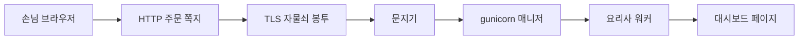

이 글은 [문제 발생에서 문제 해결까지](/http/grok-terminal-api-not-ssh/)의 문제 해결 다음에 이어집니다. 정리로 돌아가려면 [그 글](/http/grok-terminal-api-not-ssh/)을 보면 됩니다.

네 단어의 사전이다. 5056에서 400이 난 경위는 중심 글, 로그 바이트는 [주니어 팁](/http/junior-tips-first-byte-and-loopback/)에 있다.

## 1. 도입 (Context & Goal)

> 웹은 **주문 쪽지(HTTP)** 를 주고받는 식당이고, **자물쇠 봉투(TLS)** 에 넣으면 주소가 `https`가 된다. **gunicorn**은 매니저와 요리사다.
{: .wn-lede }



## 2. 트러블슈팅 (Micro-Debugging)

이름이 섞이는 지점만 둔다.

| 증상처럼 보이는 것 | 실제에 가까운 것 |
| --- | --- |
| HTTPS는 HTTP와 전혀 다른 언어 | HTTPS는 **HTTP를 TLS 위에 올린 것**이다. 주문서 양식은 같고, 봉투만 다르다 |
| TLS와 SSL은 다른 자물쇠 두 개 | SSL은 예전 이름이다. 지금 자물쇠는 TLS다. 인증서를 SSL 인증서라고 부르기도 한다 |
| `https://`만 치면 어떤 문이든 안전해진다 | 그 문이 자물쇠 악수를 받을 준비가 되어 있어야 한다 |
| 400은 비밀번호가 틀려서 | 400번대는 손님 쪽 말이 이상하다는 쪽이다. 비밀번호 확인 전에 날 수 있다 |
| gunicorn을 켜면 자물쇠가 생긴다 | gunicorn은 파이썬 앱을 부르는 식당 운영이다. 자물쇠(TLS)는 따로다 |
| 요리사를 많이 두면 무조건 빠르다 | 기본 요리사 1명은 주문 1개만 한다. 사람을 늘리면 메모리도 늘어난다 |

## 3. 해결 과정 & 코드 (Solution)

### 3-1. 네 단어를 가게 순서로 보기 (Before / After)

**Before**

```text
http, https, tls, gunicorn  →  약자 네 개
```

**After**

```text
손님 쪽지(HTTP) → 자물쇠 봉투(TLS) → 주소창의 https
접수 매니저 + 요리사(gunicorn) → 파이썬 대시보드
```

#### HTTP — 주문 쪽지

HTTP는 손님이 먼저 말을 거는 약속이다. 브라우저가 손님이고 서버가 식당이다. 서버는 요청과 요청 사이에 “아까 그 손님”을 자동으로 기억하지 않는다. 그래서 상태가 없는 대화라고 한다. 로그인 기억은 쿠키라는 추가 쪽지로 붙인다.

- **요청:** `GET`은 메뉴를 가져오기, `POST`는 입력값을 맡기기.
- **응답:** 숫자 상태 코드가 붙는다.

| 코드 | 가게 말 | 뜻 |
| --- | --- | --- |
| 200 | 주문 나왔습니다 | 성공 |
| 400 | 주문서가 식당 말이 아닙니다 | 손님 쪽 형식 오류 |
| 404 | 그 메뉴는 없습니다 | 주소는 왔지만 방이 없음 |

```text
GET / HTTP/1.1
Host: 00.00.00.000:5056
```

잘 알려진 기본 문은 HTTP 80번, HTTPS 443번이다. 이 대시보드는 그 대신 **5056번 그냥 문**을 열었다.

#### TLS — 자물쇠 봉투

TLS는 지나가는 대화를 지키는 약속이다. 웹만의 것이 아니고 메일에도 쓸 수 있다. 웹에서는 세 가지를 지킨다.

1. **남이 못 읽게** (암호화)
2. **몰래 못 고치게** (무결성)
3. **식당이 맞는지** (인증)

인증서는 가게 신분증이다. 신뢰하는 기관이 도메인 주인이라고 적어 준다. 도메인 없는 IP만으로는 그 신분증을 받기 어렵다.

자물쇠를 채우기 직전의 맞춘 대화를 TLS 악수라고 한다. 첫 신호가 `\x16`이면 “자물쇠 이야기를 시작한다”는 뜻이다. 칸으로 나누는 법은 이전 글이다.

#### HTTPS — 쪽지를 봉투에 넣은 것

HTTPS는 새 언어가 아니다. 같은 HTTP 쪽지를 TLS 봉투에 넣어 보낸다. 주소는 `https`로 시작하고 기본 문은 443이다.

```text
https  =  HTTP 주문 쪽지  +  TLS 자물쇠 봉투
```

[RFC 2818](https://datatracker.ietf.org/doc/html/rfc2818)에서 HTTP 문지기가 기대하는 첫 데이터는 주문 줄이고, TLS 문지기가 기대하는 첫 데이터는 ClientHello다. 그래서 같은 포트가 두 말을 한꺼번에 받지 못한다.

#### gunicorn — 매니저와 요리사

파이썬 앱은 레시피다. 레시피만으로는 건물 문을 열지 못한다.

- **매니저(arbiter):** 요리사 수를 지킨다. 손님 접시를 직접 만지지 않는다.
- **요리사(worker):** 쪽지를 읽어 파이썬 함수를 부르고 응답으로 되돌린다.
- **WSGI:** 홀과 주방이 주문을 주고받는 양식이다. gunicorn은 `app(environ, start_response)`처럼 앱을 부른다.

기본 요리사(sync worker)는 **한 번에 주문 1개**다. gunicorn 문서는 워커 수를 보통 CPU 코어당 2~4명부터 본다고 한다. 한 명 더 뽑을 때마다 앱을 통째로 드는 프로세스가 생겨 메모리가 늘어난다. `Starting gunicorn 23.0.0`은 식당 운영을 바꿨다는 뜻이지 자물쇠를 달았다는 뜻이 아니다.

### 3-2. 면접 연습 종합: 질문 → 내 답 → 점수 → 모범 답

#### 라운드 A — 400은 어느 단계에서 났나?

**질문 A1.** 로그인 검사가 있는데, 그 함수를 고쳐도 어떤 400은 그대로일 수 있나?

**모범 답.** 문지기가 먼저 “주문 쪽지인가”를 본다. `\x16`으로 시작하는 TLS 악수는 쪽지가 아니라서 비밀번호 검사까지 가지 못한다. 고칠 곳은 로그인 함수가 아니라 문 종류다.

#### 라운드 B — 워커를 늘리면 자물쇠가 해결되나?

**질문 B1.** 요리사를 10명으로 늘리고 gunicorn을 재시작하면, `https://아이피:5056` 400이 사라지나?

**모범 답.** 안 사라진다. 워커는 이미 통과한 주문을 나누는 인원이다. 400은 그 전에 난다. 필요한 것은 그 문이 TLS 악수를 받게 하는 일(도메인과 인증서)이거나, 브라우저 대신 글자 HTTP로 API를 호출하는 일이다.

## 4. 딥다이브 (What I Learned)

### Framework Deep-Dive

MDN에서 HTTP 세션은 연결을 열고, 요청을 보내고, 상태 코드와 본문이 담긴 응답을 받는 세 단계다. Cloudflare 기준으로 HTTPS는 그 HTTP를 TLS 위에서 쓰는 것이다.

### Industry Convention

개발용으로 혼자 받던 서버를 gunicorn으로 바꾸는 것은 흔한 다음 단계다. 그다음은 도메인과 공개 인증서다. IP만 연 HTTP는 임시 문이다.

### 확인에 쓴 자료

- [MDN — Overview of HTTP](https://developer.mozilla.org/en-US/docs/Web/HTTP/Guides/Overview)
- [MDN — A typical HTTP session](https://developer.mozilla.org/en-US/docs/Web/HTTP/Guides/Session)
- [Cloudflare — What is TLS?](https://www.cloudflare.com/learning/ssl/transport-layer-security-tls/)
- [Cloudflare — What is HTTPS?](https://www.cloudflare.com/learning/ssl/what-is-https/)
- [RFC 2818 — HTTP Over TLS](https://datatracker.ietf.org/doc/html/rfc2818)
- [Gunicorn — Design](https://gunicorn.org/design/)
- [Gunicorn — Run](https://gunicorn.org/run/)
