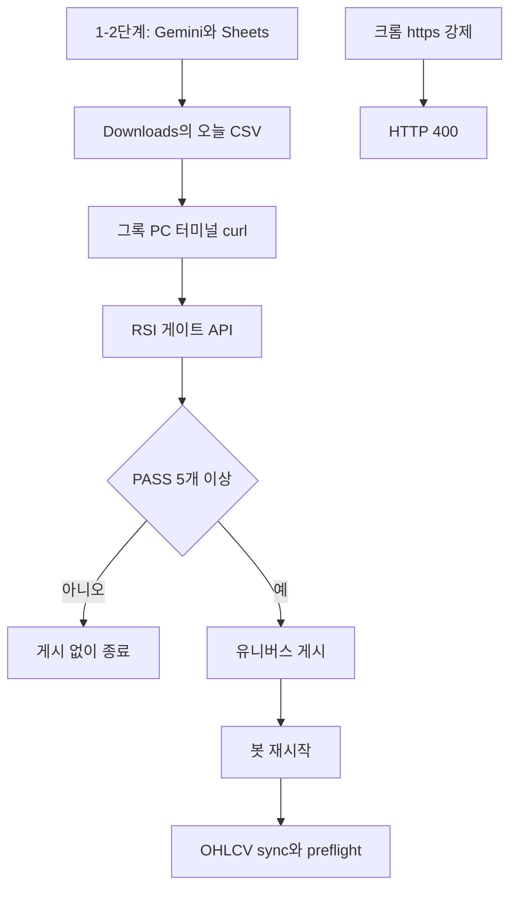

읽는 순서입니다. 이 글은 문제 발생에서 문제 해결로 가고, 각 절 끝의 링크가 다음 글입니다.

1. 이 글
2. [HTTP 400 기록](/http/http-400-https-on-plain-port/)
3. [주니어 팁 풀어쓰기](/http/junior-tips-first-byte-and-loopback/)
4. [HTTP·HTTPS·TLS·gunicorn 학습](/http/learn-http-https-gunicorn-tls/)

## 1. 문제 발생

> 그록 가상 PC에서 작성자가 만든 웹 페이지를 크롬으로 접속 했을때 `HTTP ERROR 400`이 났고, 해결 방법으로 서버에 SSH로 들어가는 것이 아닌 그록 가상 PC 터미널이 웹을 열지 않고 API를 호출하였다.
{: .wn-lede }

작성자는 미국 주식 자동매매를 하기 위해 웹 페이지를 만들었고, 해당 웹 페이지는 Hetzner 서버의 `5056` Port(건물 하나의 문 번호다.) 문에서 돌아가고 있었다. 그록봇은 매일 자동으로 세 단계의 루틴을 진행하고 있었다.

1. Gemini로 종목 CSV를 만든다.
2. 그 파일을 시트와 다운로드 폴더에 둔다.
3. 크롬으로 `http://00.00.00.000:5056/universe-rsi`에 들어가 RSI 게이트를 돌리고, 통과한 종목을 유니버스에 게시한다.

그록 가상 PC에서 자동 루틴에서 이틀은 동작되었다. 삼일째 자동 루틴 진행 중 가상 PC 크롬에서 이 문구만 보여 줬다.
```text
This page isn't working. HTTP ERROR 400
```

해당 주요 문제 발생 원인
• 주소(URL) 오타: 잘못된 문자나 오타가 포함된 경우
• 쿠키 및 캐시 충돌: 브라우저에 저장된 해당 사이트의 데이터가 손상되거나 너무 오래된 경우
• 파일 크기 초과: 업로드하려는 파일이 서버 허용 용량보다 큰 경우

이 문제를 해결하기 위해 가상 PC의 크롬 캐시를 지우고 시크릿 창을 열어도 같았다. 웹을 문을 너무 자주 여닫아서, 서버가 그록봇의 주소(IP)를 출입 금지 명단에 올린 것 아닌가 하는 의심도 했다. 같은 시각 Hetzner 상태 페이지에는 Object Storage 장애 화면도 떠 있었다.


목표는 두 가지였다. 
1. 400의 원인을 코드와 서버 로그로 확정하여 문제 파악하는 것.
2. 그록봇이 대시보드 웹 페이지를 열지 않고 3단계를 끝내게 하는 것.

비유하면, 알바생이 정문에 열쇠를 꽂으려다 쫓겨난 사건이다. 처음 떠오른 해결 방법은 건물 뒤편 관리자 문(SSH)으로 들어가는 것이었다. 

문제가 어떻게 보였는지는 [HTTP 400 기록](/http/http-400-https-on-plain-port/)에 이어서 두었습니다.

## 2. 원인 확인

코드를 뒤져도 IP를 막는 줄은 없었다. `deploy_stock_long_lab/dashboard/dashboard_auth.py`의 문지기는 손님 주소가 아니라 비밀번호(토큰)만 본다. 요청이 들어올 때마다 아래 함수가 먼저 돈다.

```python
@app.before_request
def _require_dashboard_token() -> Any:
    ep = request.endpoint or ""
    if ep in _OPEN_ENDPOINTS:
        return None
    if viewer_authorized():
        return None
    if request.path.startswith("/api/"):
        return jsonify({"status": "error", "error": "unauthorized_login_required"}), 401
    nxt = request.full_path if request.query_string else request.path
    if nxt.endswith("?"):
        nxt = nxt[:-1]
    return redirect(url_for("dashboard_login", next=nxt))
```

줄마다 보면 이렇다.
- `before_request`는 주방(각 페이지 함수)에 들어가기 전의 문지기다. 여기에는 `request.remote_addr` 같은 IP 비교가 없다.
  
- `_OPEN_ENDPOINTS`에 있는 로그인·환영·정적 파일은 통과시킨다.
  
- `viewer_authorized()`는 세션에 로그인 표시가 있거나, 헤더 `X-Settings-Token`이 환경변수 `US_SETTINGS_DASHBOARD_TOKEN`과 같을 때만 참이다.
  
- 그 둘이 아니면 갈린다. 주소가 `/api/`로 시작하면 `401`과 `unauthorized_login_required`를 돌려준다. 화면 주소면 `redirect(...)`라서 Flask 기본값인 `302`로 `/login`에 보낸다.
  
- 이 함수가 돌려주는 상태는 401과 302뿐이다. HTML 화면이 400이 되는 `return`은 없다. 그래서 크롬의 400은 이 문지기가 만든 거절이 아니다.

웹 서버에서 발생하는 로그를 파악하기 위해  아래와 같은 명령어를 입력한다.

```bash
journalctl -u us-stock-dashboard --since "2026-09-22" --no-pager | grep -F "Bad request version"
```

- `-u us-stock-dashboard`는 매매 봇이 아니라 5056번 문을 연 서비스만 고른다.
- `--since`는 그 날짜 이후만 본다. 최근 줄만 보려면 `--since` 대신 `-n 200`을 쓴다.
- `--no-pager`는 화면을 잡고 있는 읽기 모드 없이 출력하고 끝낸다.
- `grep -F`는 따옴표 안 문장을 글자 그대로 찾는다.

그때 남는 로그가 아래와 같다.

```text
code 400, message Bad request version
"\x16\x03\x01..." 400
```

`\x16\x03\x01`은 브라우저가 "지금부터 자물쇠 통신(HTTPS, TLS 악수)을 하겠다"고 보내는 첫 바이트다. `5056`은 평문 HTTP만 받는다. 자물쇠 없는 문에 열쇠를 꽂으니, 문지기가 주문서를 읽기도 전에 400을 돌려준 것이다. 로그인과 RSI 코드는 실행되지 않았다.

그록 가상 크롬은 주소창에 `http://`를 쳐도 뒤에서 `https://`로 바꾼다. 그래서 캐시 삭제와 시크릿 모드가 소용없었다. Hetzner Object Storage HEL1 장애는 사진·파일을 맡기는 창고 상품의 문제라, 우리가 빌린 컴퓨터 알림과도 무관했다.

| 증상처럼 보이는 것      | 실제에 가까운 것                         |
| --------------- | --------------------------------- |
| 너무 자주 열어서 IP 차단 | 토큰 검사만 있다. HTML이 400이 되는 줄은 없다    |
| 앱이 거절했다         | 로그 첫 바이트 `\x16`이라 문지기가 요청 줄을 못 읽음 |
| Hetzner 창고 장애   | 다른 상품. 이 서버 알림과 무관                |
| 캐시를 지워도 400     | 가상 크롬이 `http`를 `https`로 바꿈        |

원인을 로그에서 읽는 법은 [주니어 팁 풀어쓰기](/http/junior-tips-first-byte-and-loopback/)에 이어서 두었습니다.

## 3. 문제 해결

원인은 확인됐다. 해결 방법은 SSH로 매매 서버에 들어가는 방법도 있지만 그 방향으로 문제 해결하지 않겠다.

그록 PC에는 xfce 터미널만 있고 `ssh`는 없었다. 22번 문이 막혀 있을 수 있고, 서버 열쇠를 가상 PC에 두는 것도 위험했다. 더 단순한 사실이 있었다. 400이 났다는 것은 `5056`까지 연결은 됐다는 뜻이다. 크롬만 말을 자물쇠로 바꿨을 뿐이다. 터미널의 `curl`은 그 자동 변경을 하지 않는다.

**바꾸기 전.** 3단계는 크롬 웹에서 클릭을 통해 자동화 하였다.

1. 모니터 `http://77.42.64.226:5056/`를 연다.
2. 유니버스 RSI 페이지에서 오늘 CSV를 고르고 `게이트 실행`을 누른다.
3. PASS를 읽고, 충분하면 게시, 봇 재시작, OHLCV sync를 누른다.

1단계 웹 접속 단계 진행 중 400에서 멈췄다.

**바꾼 후.** 1~2단계(Gemini, 시트, `/home/box/Downloads`에 CSV 저장)는 그대로다. 3단계만 터미널이 같은 API를 호출한다. 매일 바뀌는 시트 파일명은 가장 최근 CSV를 고정 이름으로 복사해서 흡수한다. 토큰은 명령어 글자가 아니라 파일에서만 읽는다.

```bash
set -euo pipefail
TOKEN="$(cat /home/box/.secrets/trading-upload-token)"
BASE="http://00.00.00.000:5056"

latest="$(ls -1t /home/box/Downloads/*.csv | head -n 1)"
cp "$latest" /home/box/Downloads/us_rsi_candidates.csv

curl -sS --max-time 900 \
  -H "X-Settings-Token: ${TOKEN}" \
  -F "file=@/home/box/Downloads/us_rsi_candidates.csv" \
  "$BASE/api/ops/universe-rsi/run" > /tmp/rsi_run.json
```

응답 JSON의 `pass_count`가 5 미만이면 게시하지 않는다. 서버 `ops_universe_rsi.py`가 PASS 5개 미만을 `too_few_pass`로 거절하기 때문이다. 5개 이상이면 `run_id`로 게시하고, 이어서 재시작과 preflight를 호출한다.

```bash
curl -sS --max-time 120 \
  -H "X-Settings-Token: ${TOKEN}" \
  -H "Content-Type: application/json" \
  -d "{\"run_id\":\"${RUN_ID}\"}" \
  "$BASE/api/ops/universe-rsi/publish"

curl -sS --max-time 120 \
  -H "X-Settings-Token: ${TOKEN}" \
  -H "Content-Type: application/json" \
  -d '{}' \
  "$BASE/api/ops/restart-bot"

curl -sS --max-time 900 \
  -H "X-Settings-Token: ${TOKEN}" \
  -H "Content-Type: application/json" \
  -d '{}' \
  "$BASE/api/ops/ohlcv-sync-preflight"
unset TOKEN
```

대시보드 프로세스도 Flask 개발 서버에서 gunicorn으로 바꿔 두었다. gunicorn은 매니저 1명과 요리사(worker) 여러 명이 손님을 나누는 서버 프로그램이다. 400의 직접 원인은 아니었다. RSI 게이트가 한 요청을 몇 분 잡아도, 다른 접속이 덜 멈추게 하려고 둔 것이다.




해결에 나온 HTTP, TLS, HTTPS, gunicorn을 가게 이야기로 푼 글은 [HTTP·HTTPS·TLS·gunicorn 학습](/http/learn-http-https-gunicorn-tls/)에 이어서 두었습니다.

## 4. 정리


### Framework Deep-Dive

웹 서버는 식당 문지기와 같다. 주문을 주방에 넘기기 전에 "이게 사람 말인가"를 먼저 본다. 이번 400은 주방 레시피, 즉 Flask 라우트가 아니라 그 앞 문지기에서 탈락한 사고다. 그래서 앱 코드를 고쳐도 크롬 400은 사라지지 않았다. 통한 길은 문을 자물쇠로 바꾸는 공사가 아니라, 자물쇠로 말을 바꾸지 않는 터미널이 같은 API를 호출한 것이다.

### Performance & Memory (리스크)

`curl`을 고른 이유에는 속도도 있다. 크롬은 페이지, 쿠키, 자물쇠 협상을 매번 한다. 터미널 호출은 CSV와 토큰 헤더만 보낸다. 게이트가 길어질 수 있어 업로드와 preflight는 900초를 기다린다. 그 시간을 크롬 화면으로 지키면 가상 PC가 중간에 창을 닫아 작업이 끊긴다. gunicorn 요리사를 늘리는 일은 이미 통과한 요청의 대기만 줄인다. `\x16`으로 시작한 400은 요리사에게 도착하지 않는다.

### Industry Convention

자동화 봇에게 관리자 웹 화면을 클릭하게 두는 것은 임시방편이다. 사람이 보는 화면과 기계가 호출하는 API를 나누고, 토큰은 명령어 글자가 아니라 비밀 파일에서 읽은 뒤 `unset`한다. SSH로 매매 서버에 직접 들어가는 것은 더 센 권한이라, 이번 문제의 정답이 아니었다. 400은 연결이 됐다는 증거였다.

### 주니어 실전 팁 3가지

- 화면에 400이 있으면 방화벽 차단부터 단정하지 말고, 서버 로그의 요청 첫 바이트를 본다. `\x16\x03\x01`이면 HTTPS를 HTTP 포트에 보낸 것이다. 칸으로 나누는 법은 [주니어 팁](/http/junior-tips-first-byte-and-loopback/)에 있다.
- 브라우저 자동 루틴이 막히면 버튼 클릭을 고치지 말고, 그 버튼이 호출하는 API를 터미널로 재현한다.
- 매일 바뀌는 다운로드 파일명은 스크립트에 박지 말고, 가장 최근 파일을 고정 이름으로 복사한 뒤 그 이름만 올린다.

문제에서 해결로 다시 읽으려면 [HTTP 400 기록](/http/http-400-https-on-plain-port/)에서 시작해, [주니어 팁 풀어쓰기](/http/junior-tips-first-byte-and-loopback/), [HTTP·HTTPS·TLS·gunicorn 학습](/http/learn-http-https-gunicorn-tls/) 순서로 가면 됩니다.